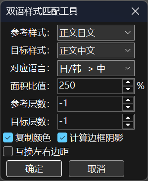
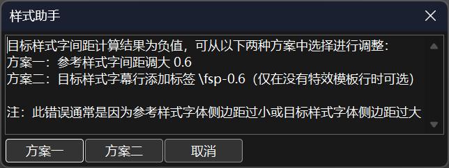

# 有任何疑问先看README

这个仓库里存放的是用于Aegisub特效字幕制作的函数库、脚本，以及我写过的一部分模板。

## 函数库

图形库 `geometry` ，顾名思义就是「几何」。支持生成几何图形，还能对图形进行复杂的操作。从简单的矩形、菱形到复杂的数学公式、分子结构式，它都能绘制。在此基础上，它还额外提供了随机数类、颜色类等常用函数。

里面的函数大体上可以分为三类：

1. 功能型
2. 生成绘图型
3. 操作绘图型

**每个函数的用法在手册中均有详细说明。**

安装函数库的方法：

1. 把 `geometry.lua` 放进Aegisub中的 `\automation\include` 这个文件夹里，例如 `C:\Program Files (x86)\Aegisub-3.3.3-win64\automation\include` 。
2. 然后在同样是 `include` 这个文件夹里的 `utils-auto4.lua` 里加一句 `require('geometry')` 即可。
3. 如果你的Aeg是开启状态，在应用模板前，点击「自动化」→「自动化(A)…」→「重新扫描自动载入文件夹(S)」，重新加载函数库。

## 脚本

**以下脚本主要适用范围：编写单首歌曲特效模板。**

模板的一般结构（从上到下）：

1. code行
2. template行
3. karaoke行
4. fx行

### 对样式和所有行生效

- 双语样式匹配工具

  

  用途：根据参考样式计算目标样式的参数，使之在视觉上与参考样式相匹配。

  依赖 [Yutils](https://github.com/Youka/Yutils/blob/T1/src/Yutils.lua) ，使用前需要先安装该库；支持中日韩字体。

  

  先解释各个参数：

  1. 参考样式：参考样式需要设置好全部参数；并且当样式名列表中包含 `JP/KR/TW/HK/CN` 语言标识的样式数量 ≥2 时，会按照语言优先级选择默认值；当参考样式和目标样式对齐方式相同且为底部或顶部对齐时，保证参考样式更靠近画面边缘。
  2. 目标样式：目标样式需要设置好样式名、字体、粗体、斜体、对齐方式；并且当样式名列表中包含 `CN/HK/TW/KR/JP` 语言标识的样式数量 ≥2 时，会按照语言优先级选择默认值；当参考样式和目标样式对齐方式相同且为底部或顶部对齐时，保证目标样式更靠近画面中心。
  3. 对应语言：参考样式语言 -> 目标样式语言；参考样式和目标样式都含有语言标识时不生效；所有合法样式都含有语言标识时不显示。
  4. 面积比值：目标样式平均字面框面积 / 参考样式平均字面框面积；底部对齐推荐值为 250 ，顶部对齐推荐值为 40 ；仅在参考样式和目标样式对齐方式相同且为底部或顶部对齐时生效。
  5. 参考层数：设定参考样式字幕行的层数，-1 表示不修改层数；仅在参考样式和目标样式对齐方式相同且为底部或顶部对齐且没有特效模板行时生效。
  6. 目标层数：设定目标样式字幕行的层数，其余同上。
  7. 复制颜色：把参考样式的颜色复制到目标样式。
  8. 计算边框阴影：根据参考样式计算目标样式的边框阴影。
  9. 互换左右边距：把参考样式的左右边距互换作为目标样式的左右边距；只在对齐方式为 2 + 8 时生效。

  <br>

  

  字间距的报错可能会很常见，根据提示选择按钮即可。

  

  注意事项：

  1. 最终效果与字体匹配度有关，请务必选择匹配度高的字体。
  2. 不支持西文字体，也不保证中日韩字体在英文下的匹配效果。
  3. 两种样式交替反复应用脚本会累积系统误差，单方向反复应用则不会。
  4. 如果按钮乱码，就是低版本 Aegisub 的 Bug ，请升级版本。

  

  **致谢：感谢 MingYSub 的 [Ming](https://github.com/oborozuk1) 。Ming 佬不仅帮我测试了脚本，还提出了许多宝贵的意见。如果没有 Ming 佬的帮助，这个脚本肯定不会像现在这样完善。顺便一提，我就是看了 Ming 佬给北宇治做的败犬女主 OP 特效才入坑特效字幕的。**

  

### 对所有行生效

- 遍历统计各类行数

  以遍历所有行的方法统计code行、template行、karaoke行、fx行、模板行（code行 + template行）的行数以及总行数，并输出日志。

- 逻辑统计各类行数

  统计各类行数同上，但是即使是100万行也能瞬间出结果。

- 统计时间较短行

  会将时间较短的行显示在日志下面，适用于单语双语两种情况。

- 选中奇数行或偶数行

- 执行自动化并统计耗时

  依赖 `kara-templater.lua` 执行自动化，只有在可用 `kara-templater.lua` 执行自动化时才会变为启用状态，否则为禁用状态。

- 只留fx行

- 只留k值

  会把字幕文件删成只有带k值的歌词。

- 只留歌词

- 重置karaoke行

  会删除歌词中的标签、删除说话人、清空特效栏并取消注释。
  
- 获取行宽度

  会在第一行前插入一行code行，定义所有样式的宽度表，命名规则如下。
  
  ```lua
  local style = string.lower(line.style).."_wid"
  ```
  
  所以你的样式名必须遵循Lua的变量命名规则：只由字母、数字和下划线组成，并且不能以数字开头。同时也不能有字母全转小写后相同的样式名，否则前一个样式的宽度表会被覆盖。
  
  如果已经应用过脚本，会直接修改原行。
  
- 判断上下句时间是否连续

  会在第一行前面插入一行code行，定义时间连续性判断表，0 为不连续，1 为连续。如果已经应用过脚本，会直接修改原行。所有样式的时间必须完全一致，建议先用「统计时间较短行」脚本检查。

### 对所选行生效

- 处理一行AI2ASS转出的字符串

  把AI2ASS转出来的字符串粘贴到一行的文本区里，它会提取出color表和shape表。

- 勾选、取消注释

  要搭配快捷键使用，不然反而麻烦。

- 绘图坐标取整

- 添加常用code行和template行

  选中几行就会在选中的行上面添加几行你想添加的行。还可以添加AutoTags函数和Yutils的文字转绘图函数；添加all和fxgroup修饰语以及用于fxgroup判断的code行。脚本在添加行后会返回一个空表来改变选中行的逻辑，如果只添加一行的话，在添加完后会选中添加的行下面那一行（经测试3.3.3版本是这样，但是3.2.2版本会不选中任何行，其他版本未测试）。配合快捷键，可以做到1秒添加5行以上。

- 添加平均kf标签

  会给选中的歌词行添加平均kf标签，已有k、kf、ko标签的行不会重复添加。但需要注意的是，歌词行中不能存在这三种标签以外的其他标签，而且也无法依据单词给英文打kf标签。

- 选中相同样式行

  如果选中多行，脚本会以第一行的样式为准。

*注：对所选行生效的脚本需要先选中需要选中的行。*

安装脚本的方法：

1. 把脚本放进Aegisub中的 `\automation\autoload` 这个文件夹里，例如 `C:\Program Files (x86)\Aegisub-3.3.3-win64\automation\autoload` 。
2. 如果你的Aeg是开启状态，在使用脚本前，点击「自动化」→「自动化(A)…」→「重新扫描自动载入文件夹(S)」，重新加载脚本。

**为你所使用的脚本配置快捷键能更加省时省力**。

配置快捷键的方法：

1. Alt+O，「界面」→「热键」→「默认」→「新建」。
2. 点击 `Hotkey` ，按下你要使用的按键，接着在中间的 `Command` 里写 `automation/lua/` ，然后下拉点击你要选择的脚本即可。

推荐使用 Alt + 其他 ；如果你想用 Shift + 其他 ，推荐在「字幕栏」里添加快捷键。

如果懒得配，你可以直接用我的快捷键配置，下载链接在文末的杂项里。也可以修改配置文件，修改完后需要重启Aegisub才会生效。快捷键配置文件的路径为 `C:\Users\你的用户名\AppData\Roaming\Aegisub\hotkey.json` 。

~~配好脚本快捷键后你就可以光速连招爽玩Aeg~~

## 模板

分为 **砂糖酱の代表作** 和 **给组里做的特效** 。

如果还不会自动化，可以先看 [我的B站教程](https://www.bilibili.com/video/BV1KmGTzmEp5?vd_source=6df8fb6687b936d34db1b244f6a15be5)

模板平均运行时间均使用「执行自动化并统计耗时」脚本计算得出。

### 砂糖酱の代表作

这里是我最满意的几个作品的模板，经过多次整理优化，可以说是完美的。

#### 1. 三つ葉の結びめ（来自风平浪静的明天NCED3）

**模板平均运行时间：0.012秒。**

这个模板不需要安装任何函数库，但是需要加载 [VSFilterMod滤镜](https://github.com/qwe7989199/aegisub_scripts/tree/master/VSFilterMod_bin)

加载VSFilterMod滤镜的方法：

1. 把dll放进 `csri` 这个文件夹中，例如：`C:\Program Files (x86)\Aegisub-3.3.3-win64\csri` 。
2. Alt+O，「高级」→「视频」→「字幕来自」，选择 `CSRI/vsfiltermod_textsub` 。

把 `1.png` 直接放进D盘即可，如果想放别的地方就改一下模板里的路径。

#### 2. GRIDOUT（记忆缝线NCOP）

**模板平均运行时间：1.45秒。**

- **这个算是我自认为做得最好的作品**

需要安装 `geometry` 函数库。

这里面的逐帧用的是我自己添加的内联变量 `$fdur` ，你可以在 `autoload` 这个文件夹里的 `kara-templater.lua` 里的 `varctx` 这个表里加一句

```lua
fdur = aegisub.ms_from_frame(101) and (aegisub.ms_from_frame(101) - aegisub.ms_from_frame(1))/100 or 1001/24
```

如果你不想加的话，就把所有 `$fdur` 都显式地替换为 `(1001/24)` ，这是帧率为23.976时一帧的持续时间。

#### 3. 鏡面の波（宝石之国NCOP）

**模板平均运行时间：2秒。**

需要安装 `geometry` 、[Yutils](https://github.com/Youka/Yutils/blob/T1/src/Yutils.lua) 还有多华宫前辈的 [3D库-space](https://github.com/WitchCraftWorks66/StupidAss/blob/main/3D%E7%9B%B8%E5%85%B3/%E5%87%BD%E6%95%B0%E5%BA%93/b%E7%AB%99BV1zK4y1Q76i/space.lua) 和 [多边形库-polyc](https://github.com/WitchCraftWorks66/StupidAss/blob/main/%E5%A4%9A%E8%BE%B9%E5%BD%A2%E5%BA%93/ployc%E4%BC%98%E5%8C%96%E6%9B%B4%E6%96%B0%E7%89%88/polyc.lua) 。

这里面的 `fdur` 与上面的内联变量 `$fdur` 不同，它是像 `j` 和 `maxj` 那样的全局变量（相对于模板执行环境而言）。你可以在 `kara-templater.lua` 里的 `apply_templates` 这个函数里加一句

```lua
tenv.fdur = aegisub.ms_from_frame(101) and (aegisub.ms_from_frame(101) - aegisub.ms_from_frame(1))/100 or 1001/24
```

`gloop` 这个函数也是多华宫前辈写的。

```lua
tenv.gloop =
	function(differ_loop,rand_num)
		local cnt = {0}
		if type(differ_loop) == "number" then
			if tenv.j == 1 then
				tenv.maxloop(differ_loop)
				tenv.num = {}
				tenv.gi = 1
				tenv.gn = 1
				tenv.gin = differ_loop
			end
			tenv.gii = tenv.j
		elseif type(differ_loop[1]) == "table" then
			if tenv.j == 1 then
				tenv.gn = differ_loop[1][1]
            	tenv.gin = differ_loop[1][2]
				tenv.num = {} tenv.maxloop(tenv.gn*tenv.gin)
			end
			tenv.gi = math.ceil(tenv.j/tenv.gin)
			tenv.gii = tenv.j % tenv.gin == 0 and tenv.gin or tenv.j % tenv.gin
		else
			for i = 1,#differ_loop do
				cnt[i + 1] = cnt[i] + differ_loop[i]
			end
			if tenv.j == 1 then
				tenv.maxloop(cnt[#cnt])
				tenv.num = {}
            	tenv.gn = #cnt - 1
			end
			for i=2,#cnt do
				tenv.gi = i - 1
            	tenv.gin = cnt[i] - cnt[i - 1]
				tenv.gii = tenv.j - cnt[i - 1]
				if tenv.j <= cnt[i] then
					break
				end
			end
		end
		if type(rand_num) == "table" and tenv.gii == 1 then
			tenv.num[tenv.gi] = {}
			for i=1,#rand_num do
				tenv.num[tenv.gi][rand_num[i][1]] = math.random(rand_num[i][2],rand_num[i][3])
			end
		end
		return ""
	end
```

它是一个分组循环的函数，具体用法可以看 [多华宫前辈的教程](https://www.bilibili.com/video/BV1mv411i7Rm?vd_source=6df8fb6687b936d34db1b244f6a15be5)

把它加在 `kara-templater.lua` 中的 `apply_templates` 这个函数的 `tenv.maxloop` 后面即可。

如果不想加，可以在code行中定义它，也可以用 [我的Aegisub](###我的Aegisub) 。

### 给组里做的特效

目前，这部分都是我在拨雪寻春字幕组制作的特效。这些新番的OPED特效模板我一般会在OP和ED都做完之后更新到这里。模板不一定整理过，并且最终体积大于10MB的不带fx行。这些模板均基于 **CC BY-NC-SA 4.0** 协议共享。

需要注意的是，这里面的模板质量参差不齐，不过大部分都质量在线。因为给组里做新番特效，虽然没有DDL，但是总不能一个OP就做上一个月。这时可以稍微牺牲一下模板的质量，但是无论如何都要保证最终效果的质量。

另外，我参与制作的这些番如果组里弃坑了，我也不会把模板从仓库中删除。

由于给组里做的所有特效的模板全放进仓库里了，数量太多，就只介绍一个做的最好的吧。

#### Petals（春夏秋冬代行者OP）

**模板平均运行时间：1秒。**

需要加载 `geometry` 、[Yutils](https://github.com/Youka/Yutils/blob/T1/src/Yutils.lua) 和 split（由多华宫前辈的拆字算法整理而成，可以在我的Aegisub中找到它）。

效果思路可见 [我的B站专栏](https://b23.tv/JsOoOnz) ，不过专栏里是6行模板的版本，现已简化至3行。

模板中的 `line.prev` 和 `line.next` 是我在 `kara-templater.lua` 里添加的字段，作用分别是是获取前一行数据和获取后一行数据。你可以在 `apply_templates` 这个函数里最后的whlie循环里的 `karaskel.preproc_line(subs,meta,styles,l)` 和 `if apply_line(meta,styles,subs,l,templates,tenv) then` 这两行间添加以下代码

```lua
if i == 1 then
    l.prev = nil
else
    l.prev = subs[i-1]
    if l.prev.class == "dialogue" and ((l.prev.effect == "" and not l.prev.comment) or l.prev.effect:match("[Kk]araoke")) then
        l.prev.i = i - 1
        karaskel.preproc_line(subs,meta,styles,l.prev)
    else
        l.prev = nil
    end
end
if i == n then
    l.next = nil
else
    l.next = subs[i+1]
    if l.next.class == "dialogue" and ((l.next.effect == "" and not l.next.comment) or l.next.effect:match("[Kk]araoke")) then
        l.next.i = i + 1
        karaskel.preproc_line(subs,meta,styles,l.next)
    else
        l.next = nil
    end
end
```

## 杂项

### 我的Aegisub

[阿里云盘链接](https://www.alipan.com/s/sbKkXdQmPVM) ，**不定期更新。**

里面有：

- 我的Aegisub（函数库和脚本都已经配置好了）

  *注：*

  1. *`include` 这个文件夹里的 `karaskel-auto4.lua` 的第67~79行被我注释掉了，所以它在执行自动化后不会再生成假名样式。如果你希望生成，就把这块代码取消注释。*

  2. *位置类内联变量被我修改成了保留3位小数，所以像素效果需要注意取整。因为单个像素绘图在渲染时位置坐标和绘图代码必须都是整数才能渲染出完全不透明的像素。*

- 界面配置文件

- 快捷键配置文件

- 各种手册文档

**注意！！！如果你想用我的配置文件，一定要先备份自己的配置文件！！！**

### 什么样的模板才是好的？

简洁的、运行速度快的、成品体积小的。

比如常用的函数可以放进自己的函数库里，这样就不用在code行里定义，模板看上去就简洁了；如果日文和中文的模板一样就用all修饰语等等。

[简化模板的技巧](https://b23.tv/mIyhsHb)

至于运行速度，则可以优化函数、优化模板。用更快、更简单的方法实现相同的效果；去掉多余的操作等等。

**松坂さとう**

**2025.08.09**

